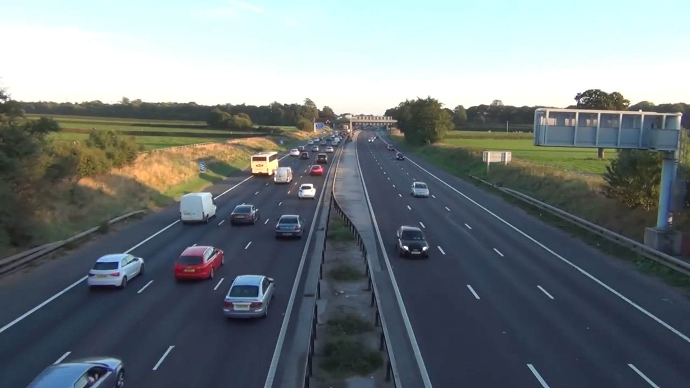
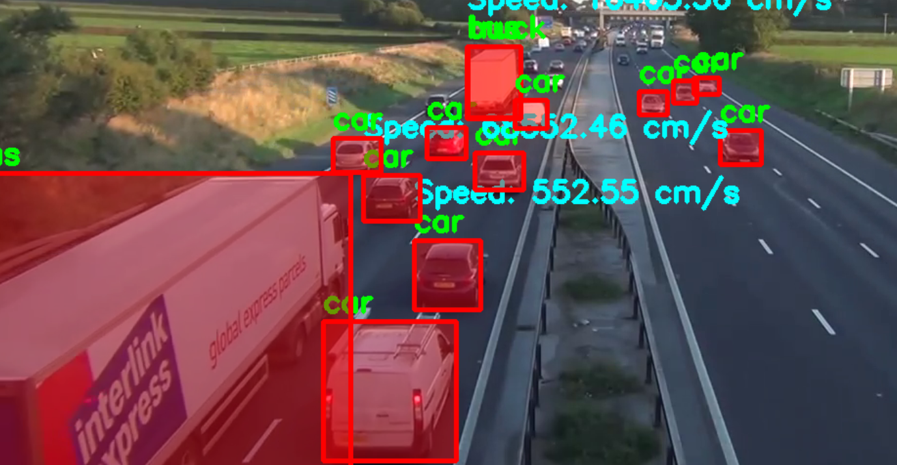

# Speed Estimation Project using YOLO Models

## 📌 Description
This project involves the development of a speed estimation system using YOLO (You Only Look Once) object detection models. The system is designed to detect moving objects (e.g., vehicles) in real-time and estimate their speed based on successive video frames. This can be used for traffic monitoring and analysis.

## 🚀 Features
- **Real-time object detection using YOLOv8**
- **Speed estimation based on movement across frames**
- **Supports both webcam and pre-recorded video input**
- **Overlay bounding boxes with speed estimation labels**
- **Easy to use and modify**

## 🛠 Requirements
- Python 3.x
- OpenCV (`cv2`)
- Ultralytics YOLOv8
- NumPy
- Matplotlib

## 📥 Installation

1. **Clone the repository:**
   ```bash
   git clone https://github.com/yourusername/speed-estimation-yolo.git
   cd speed-estimation-yolo
   ```

2. **Create a Virtual Environment:**
   ```bash
   python3 -m venv venv
   source venv/bin/activate  # On Windows use `venv\Scripts\activate`
   ```

3. **Install dependencies:**
   ```bash
   pip install -r requirements.txt
   ```

## 🎥 Running the Project

### Using Webcam:
   ```bash
   python webcam.py
   ```

### Using a Video File:
   ```bash
   python video_capture.py
   ```

### Using the Main Script (Choose Input Mode):
   ```bash
   python main.py
   ```
   - It will prompt you to enter `w` for Webcam or `v` for a Video file.

## 📂 Project Structure
```
📁 speed-estimator-using-yolo
│── .venv/                  # Virtual environment (optional)
│── readmejunks/            # Folder for demo media files
│   ├── download.mp4        # Sample input video
│   ├── output_video.mp4    # Output result video
│   ├── image.png           # Sample output image
│── .gitignore              # Git ignore file
│── LICENSE                 # License file
│── main.py                 # Main script for detection
│── README.md               # Documentation
│── requirements.txt        # Required dependencies
│── trials.ipynb            # Jupyter notebook for testing
│── video_capture.py        # Script for processing video files
│── webcam.py               # Script for processing webcam feed
│── yolov8n.pt              # Pre-trained YOLOv8 model
```

## 📸 Demo
### 🎬 Input Video


### 🎬 Output Video


### 📷 Working Proof
#### Before Processing:


#### After Processing:


## 📝 License
This project is open-source and available under the MIT License.

---
💡 **Feel free to contribute and improve the project!** 🚀

